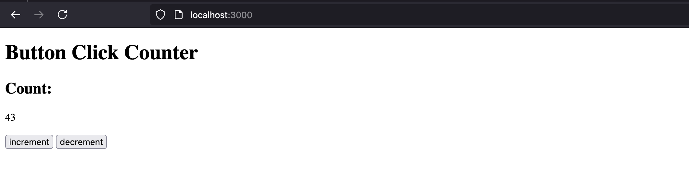

## desc

overkill button counter

## preview



## stack

TypeScript, Express, PostgreSQL, HTML/CSS, Docker

## how to develop

```bash
npm install
npm run dev
# starts nodemon and watches for changes in /src
```

## how to test
```bash
npm run test
```

## how to use
- create a pqsql db
- copy env.template to a new .env file with db credentials
- run this cmd in dir root

```bash
npm install # if you haven't alr 
npm run build
npm run start
```

- navigate to http://localhost:3000

